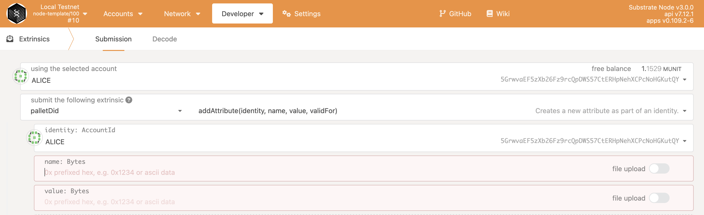

# Substrate DID test Template

## Rust Setup

First, complete the [basic Rust setup instructions](./docs/rust-setup.md).

## Run

Use Rust's native `cargo` command to build and launch the template node:

```sh
cargo run --release -- --dev
```

## Build

The `cargo run` command will perform an initial build. Use the following command to build the node
without launching it:

```sh
cargo build --release
```

## Run Different Account

This command will start Alice's account:

```bash
./target/release/node-template --base-path /tmp/alice --chain local --alice --port 30333 --ws-port 9945 --rpc-port 9933 --node-key 0000000000000000000000000000000000000000000000000000000000000001 --telemetry-url "wss://telemetry.polkadot.io/submit/ 0" --validator
```

You need then to start Bob's account to run DID Extrinsics:

```bash
./target/release/node-template --baseath /tmp/bob --chain local --bob --port 30334 --ws-port 9946 --rpc-port 9934 --telemetry-url "wss://telemetry.polkadot.io/submit/ 0" --validator --bootnodes /ip4/127.0.0.1/tcp/30333/p2p/12D3KooWEyoppNCUx8Yx66oV9fJnriXwCcXwDDUA2kj6vnc6iDEp
```

Purge the old chain's data from Alice's account:

```bash
./target/release/node-template purge-chain --base-path /tmp/alice --chain local -y
```

Purge the old chain's data from Bob's account:

```bash
./target/release/node-template purge-chain --base-path /tmp/bob --chain local -y
```


## Connect with Polkadot-JS Apps Front-end

Once the node template is running locally, you can connect it with **Polkadot-JS Apps** front-end
to interact with your chain. [Click
here](https://polkadot.js.org/apps/#/explorer?rpc=ws://localhost:9945) connecting the Apps to your
local node template.


## Pallets

The runtime in this project is constructed using many FRAME pallets that ship with the
[core Substrate repository](https://github.com/paritytech/substrate/tree/master/frame) and a
template pallet that is [defined in the `pallets`](./pallets/template/src/lib.rs) directory.

In this repository, the following [pallet-did](https://github.com/Damfortx8/pallet-did) is used.
To test it, connect to the Polkadot-JS and go to the Extrinsics:
